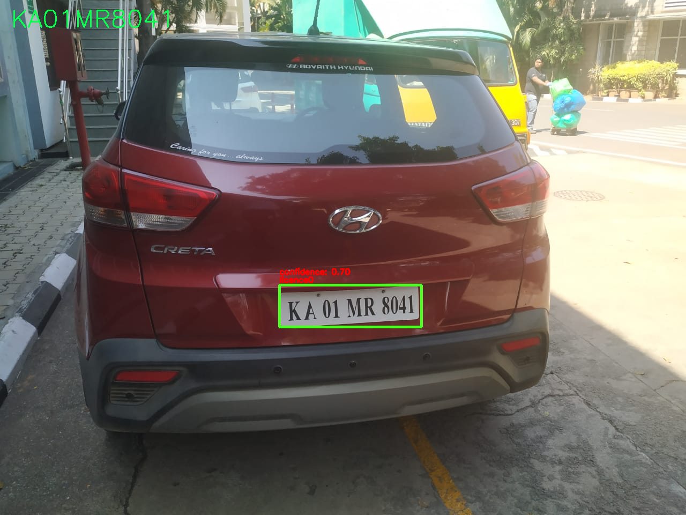
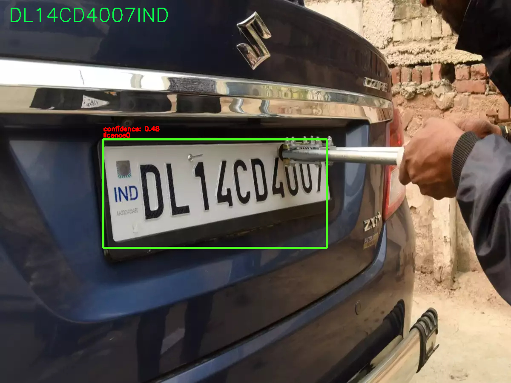

# Automatic licence plate detection with OCR

## 📌 Introduction
This Machine Learning Web Application is used for capturing license plate of car using object detection algorithm and reads the license plate usin OCR(Optical Character Recognition) and return it to nosql Database like MongoDB. 
The dataset is obtained from webscraping google images for license plates , google open images dataset and few open source images.

## 🎯 Purpose of this Project
This project is implemented in car parking system where when user enters the parking lot it captures the licence plate number and the face of the driver to store their information.
This can also be used by traffic controlling team and capture the number plate of the cars those break the rules.

<p align="center">
  
</p>

<p align="center">
  
</p>

<p align="center">
  
</p>

## 🏁 Technology Stack

* [YOLOv5](https://github.com/ultralytics/yolov5)
* [PaddleOCR](https://github.com/PaddlePaddle/PaddleOCR)
* [PyTorch](https://pytorch.org/)
* [Flask](https://github.com/pallets/flask)
* [Docker](https://www.docker.com/)

## Installation Steps
1. Clone the Repo by going to your local Git Client and pushing in the command:
```sh
git clone https://github.com/Shashank238/Automatic_licence_plate_det_OCR
```
2. Install the packages:
```sh
pip install -r requirements.txt
```
3. Run the application:
```sh
python app.py
```
4. If you want to run it on camera:
```sh
python detect_cam.py
```


